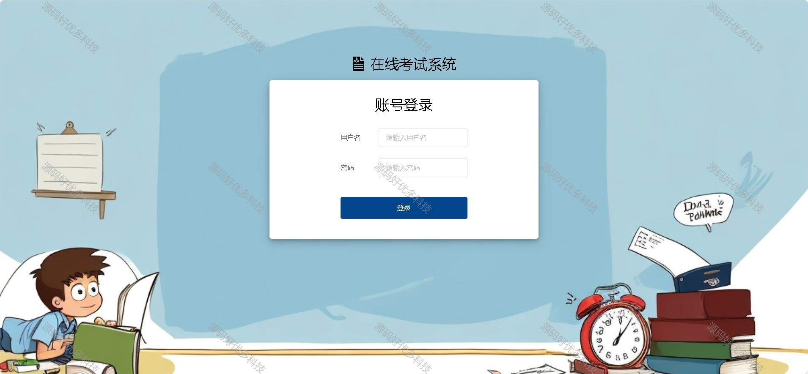
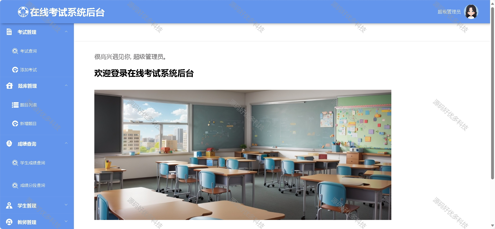
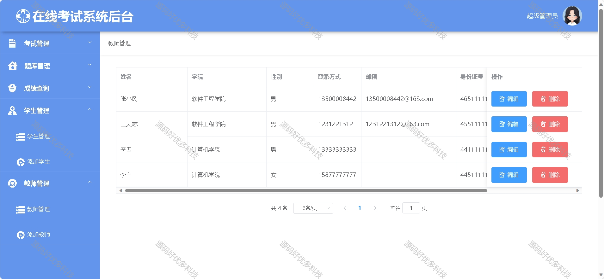
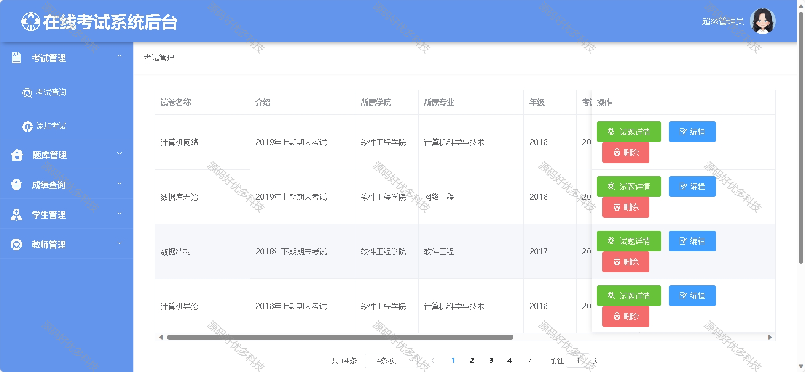
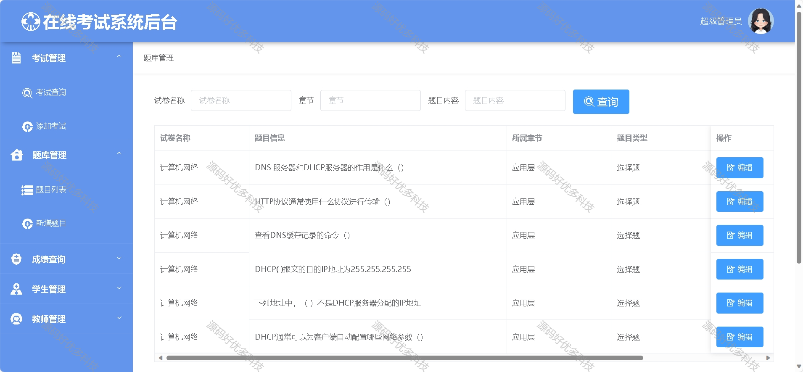
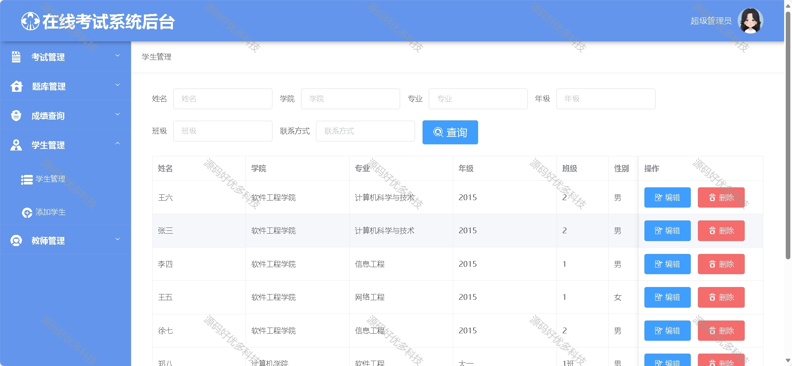
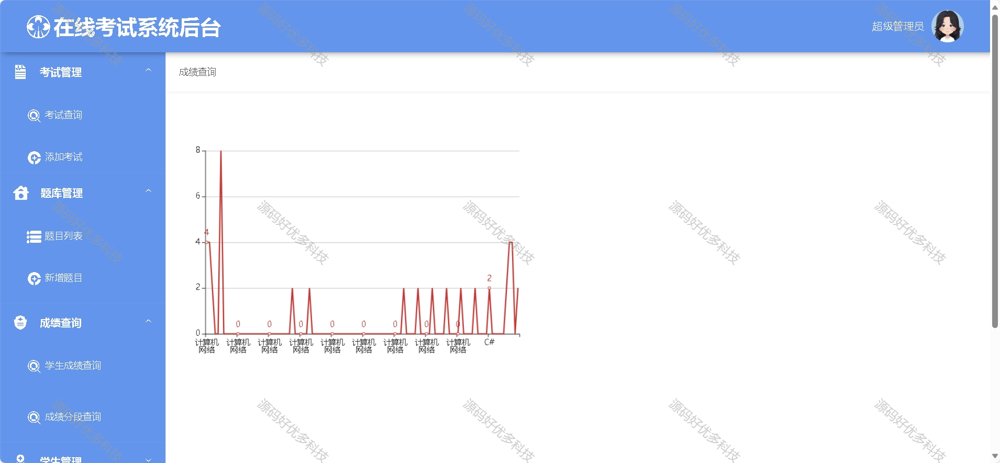
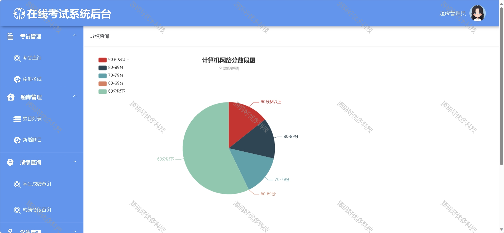
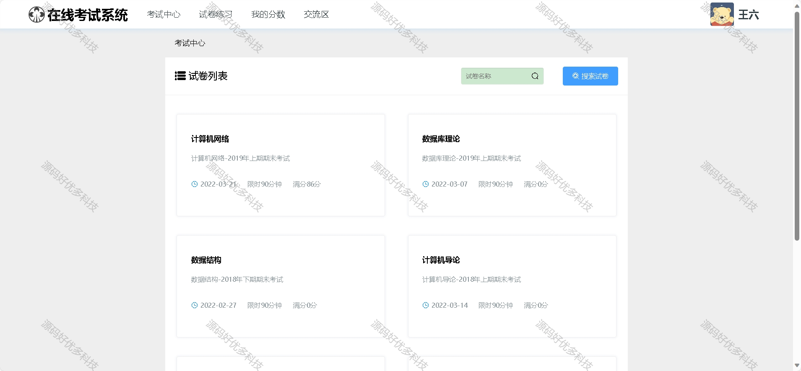
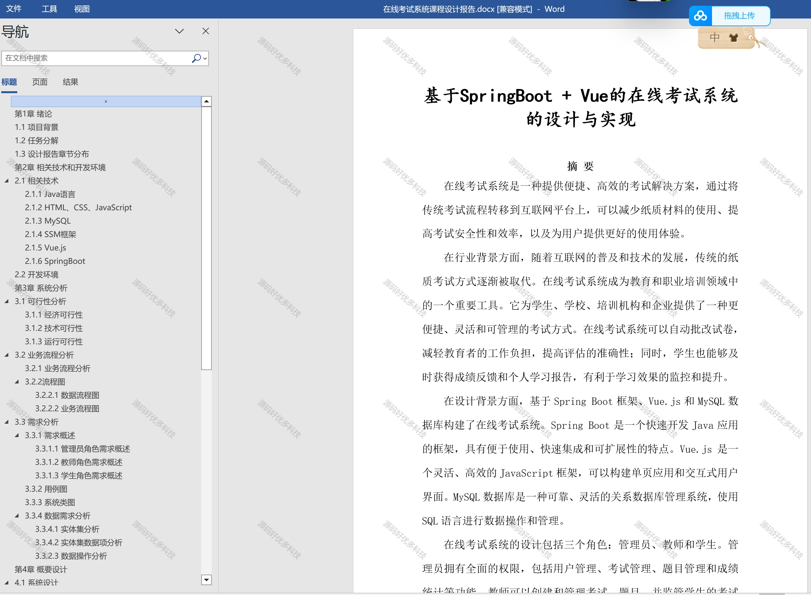

### 一、作品包含

源码+数据库+设计文档+全套环境和工具资源+部署教程

### 二、项目技术

前端技术：Html、Css、Js、Vue、Element-ui

数据库：MySQL

后端技术：Java、Spring Boot、MyBatis

### 三、运行环境

开发工具：IDEA/eclipse

数据库：MySQL8.0

数据库管理工具：Navicat10以上版本

环境配置软件： JDK1.8+Maven3.6.3

前端Nodejs：16

### 四、项目介绍

项目编号：springbootA004

传统的教育方式受限于时间和空间，无法满足人们的灵活学习需求。而在线教育通过利用互联网技术，打破了传统教育的限制，提供了更加灵活、自主、便捷和高效的学习途径。
在线考试作为在线教育的一部分，成为了评估学生学习成果的重要手段。传统的考试方式存在很多缺点，如需要纸质试卷、人工评分、时间和空间限制等。这些问题不仅增加了教师的工作量，也限制了考试的效率和准确性
1.管理员
通过登录系统后，可以进行考试管理和题目管理等功能，包括创建、修改、删除考试和题目，同时可以查询学生成绩并以折线图和饼状图展示，还可以对学生和教师进行管理。
2.教师
教师通过登录系统后，可以进行考试管理和题目管理等功能，包括创建、修改、删除考试和题目；同时可以查询学生成绩以折线图展示。
3.学生
登录、修改密码、考试中心（查询考试列表）、考试答题、提交试卷、查看成绩、交流区（发送留言和评论留言）

### 五、运行截图

